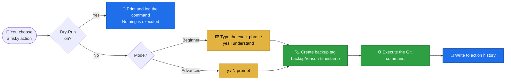
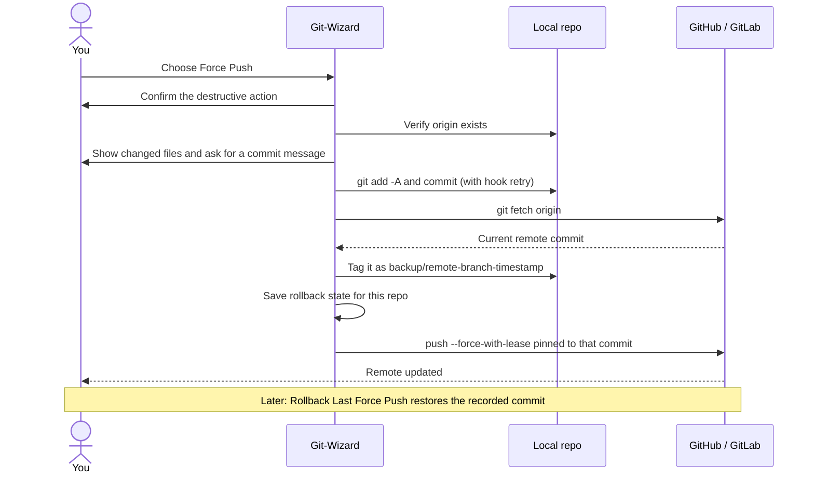
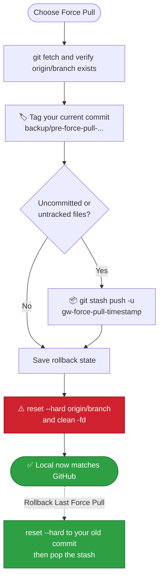
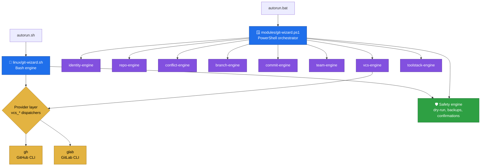

<div align="center">


<a href="https://github.com/ali4210/Git_Wizard_Ultimate">
  
</a>

<br/>


**A cross-platform CLI suite that turns risky Git, GitHub and GitLab chores into guided, one-click, _reversible_ operations.**

Built for beginners who fear `git push --force`, and for DevOps / DevSecOps engineers who want their workflow automated and auditable.

<br/>

[**Why**](#why) · [**Features**](#features) · [**Safety**](#safety) · [**Rollback**](#rollback) · [**Install**](#install) · [**Usage**](#usage) · [**Architecture**](#architecture) · [**FAQ**](#faq) · [**Roadmap**](#roadmap)

</div>

---

<a id="glance"></a>

## ⚡ At a Glance

<table align="center">
  <tr>
    <td align="center"><h3>9</h3><sub>Main modules</sub></td>
    <td align="center"><h3>2</h3><sub>Native engines<br/>(Bash + PowerShell)</sub></td>
    <td align="center"><h3>2</h3><sub>Hosting providers<br/>(GitHub + GitLab)</sub></td>
    <td align="center"><h3>3</h3><sub>Operating systems<br/>(Linux, macOS, Windows)</sub></td>
    <td align="center"><h3>8+</h3><sub>Tools managed<br/>(gh, glab, delta, lazygit...)</sub></td>
    <td align="center"><h3>1</h3><sub>Click to undo a<br/>force push</sub></td>
  </tr>
</table>

> [!TIP]
> **In 30 seconds:** clone it, run `./autorun.sh` (Linux/macOS) or double-click `autorun.bat` (Windows), pick **Beginner** or **Advanced** mode, and drive everything from numbered menus. Nothing destructive ever runs without a backup tag and a confirmation.

---

<a id="why"></a>

## 🎯 Why Git-Wizard?

Everyday Git work is full of sharp edges:

- 😱 A force push overwrites the wrong commit and there is no way back
- 🔀 A local branch gets so tangled you just want it to match GitHub
- 🔑 An SSH key refuses to authenticate and you are lost between `ssh-agent`, `~/.ssh` and GitHub settings
- 🧩 Every team member remembers a different set of commands

Most tools either **hide Git completely** or **leave you alone with raw commands**. Git-Wizard sits in between: menu-driven workflows for the whole lifecycle, with a **safety net under every destructive action**.

### 🥊 Raw Git vs Git-Wizard

| Situation | 😬 Raw Git | 🧙 Git-Wizard |
|---|---|---|
| Force push to a branch | `git push --force`, and hope | Records the remote first, pushes with `--force-with-lease`, **one-click rollback** |
| Force pull over local work | `reset --hard` and lose uncommitted files | Tags your commit, **stashes even untracked files**, rollback restores everything |
| First-time SSH setup | ~8 manual steps across terminal and browser | **One pipeline**: generate, agent, upload via API, test connection |
| Create a repo and push | Web UI, copy URL, `remote add`, `push -u` | **1-click**: creates the remote, sets origin (SSH or HTTPS), pushes |
| Pre-commit hook reformats files | Commit fails, re-add, re-commit | **Auto re-stages and retries once** |
| GitHub vs GitLab commands | Two different CLIs to learn | **One menu** routed to `gh` or `glab` automatically |
| "What did I do yesterday?" | Dig through the reflog | Built-in **action history** log |

---

<a id="preview"></a>

## 🖥️ See It in Action

> [!NOTE]
> The screens below reproduce the real menu layouts. Values such as timestamps and hashes are illustrative.

<details open>
<summary><b>🛠️ Smart Conflict Resolver</b> (Main Menu → 2 → 6)</summary>

```text
🛠️  SMART CONFLICT PUSH RESOLVER  (branch: main)

  [1] Safe Pull & Rebase
  [2] Safe Pull & Merge
  [3] Force Push (Overwrites remote!)
  [4] Force Pull (Overwrites local!)
  [5] ⏪ Rollback Last Force Push (available)
  [6] ⏪ Rollback Last Force Pull
  [0] Back
Select strategy [0-6]:
```

</details>

<details>
<summary><b>🚀 A Force Push, start to finish</b></summary>

```text
Select strategy [0-6]: 3

⚠ DESTRUCTIVE ACTION: Force push 'main' — overwrites the remote branch
Proceed? (y/N): y
--> Uncommitted changes detected:
 M linux/git-wizard.sh
?? modules/conflict-engine.ps1

Enter commit message (ENTER to cancel): feat: add force push rollback
[✔] Safety backup created: backup/pre-force-push-20260920-135001
--> Recording current remote state (for rollback)...
[✔] Rollback point saved: backup/remote-main-20260920-135003 (a1b2c3d4)
[✔] Force push done. Undo it anytime via 'Rollback Last Force Push'.
```

</details>

<details>
<summary><b>📡 Live Sync Panel</b> (optional header on every screen)</summary>

```text
🔄 main: 🟠 Behind — pull recommended  (⬆️ 0 ahead  ⬇️ 2 behind, origin/main)
🌐 Remote reachable — data is current
📦 1 stash(es) saved — don't forget these
🕐 Last commit: 3 hours ago
✅ Pull will likely be clean (no conflict markers detected)
```

</details>

<!-- 📸 Add real screenshots here for maximum impact:
<p align="center"></p>
-->

---

<a id="features"></a>

## ✨ Feature Tour

The main menu is organised into nine modules. Every submenu uses **`0` = Back**, consistently on both platforms.

| # | Module | What it does |
|:-:|---|---|
| **1** | 🔐 **Identity and SSH** | Git identity, ED25519 keys, end-to-end SSH setup, GitHub key manager, PAT vault, remote URL manager |
| **2** | 📦 **Repository and Smart Push** | 1-click repo setup and destroy, quick push, status, reset and undo, **Force Sync**, **Smart Conflict Resolver with rollback**, `.gitignore` generator, pre-commit hooks |
| **3** | 🌿 **Branch Manager** | Arrow-key branch switching, publish, and dual purge (local and remote) |
| **4** | ✍️ **Conventional Commits** | Guided `feat / fix / docs / refactor / chore` messages with scope |
| **5** | 👥 **Team and Open Source** | Linear workflow, Team Mode with admin review, fork and upstream sync, PRs, Safe Update Sync |
| **6** | ⚡ **Hosting Power Tools** | Issues, PRs/MRs, releases, CI, gists/snippets, codespaces, repo admin, raw API, **Delta Diff Suite** |
| **7** | 🌍 **Universal Global CLI** | Run `git-wizard` from any folder, permanently |
| **8** | 🧰 **Tool Stack Manager** | Detect, install, version-check and update the helper tools |
| **9** | ⚙️ **Settings** | Mode, Dry-Run, sync panel, history, self-update, checkpoints, tool rollback |

<details>
<summary><b>🔐 1 · Identity, SSH and Tokens</b> (click to expand)</summary>

<br/>

| Capability | Details |
|---|---|
| **Global identity** | Check and set `user.name` and `user.email` |
| **SSH Manager** | Install and start the SSH service; generate an ED25519 key and print the public key |
| **End-to-End SSH Setup** | Detects existing keys → generates one with a custom title → starts `ssh-agent` → checks by **fingerprint** whether the key is already on GitHub → uploads through `gh` → tests `ssh -T git@github.com` |
| **GitHub Key Manager** | Table of ID, title, fingerprint and date; delete a single key or **purge all** (with strong confirmation) |
| **PAT Vault** | Guided creation of fine-grained or classic tokens (opens the right GitHub page), save with an alias, view, delete locally or **locally and on GitHub**, optional password lock |
| **Remote URL Manager** | Inspect remotes, set a new origin (auto-strips a pasted `git remote add origin` prefix), toggle **HTTPS ⇄ SSH** |
| **gh Auth Manager** *(Windows)* | Login, logout, status and API reachability check |

</details>

<details>
<summary><b>📦 2 · Repository and Smart Push Engine</b></summary>

<br/>

| Capability | Details |
|---|---|
| **1-Click Complete Setup** | `git init` → `main` → commit → **creates the remote on GitHub/GitLab** (public or private) → choose SSH or HTTPS → set origin → push |
| **1-Click Destroy** | Detects the remote from `origin`, deletes it on the host, and offers to auto-fix a missing `delete_repo` scope |
| **Quick Push** | `add` → commit → push, with hook-retry |
| **Reset and Undo Utility** | Unstage, discard changes, soft or hard rollback of the last commit, and **Force Sync with Origin** |
| **Force Sync with Origin** | 5-step nuclear reset: detect branch and remote → backup tag → fetch → `reset --hard` → `clean -fd` |
| **Smart Conflict Resolver** | Safe rebase, safe merge, **Force Push and Force Pull, each with rollback** ([details](#rollback)) |
| **`.gitignore` Generator** | Templates for Python, Node.js and Go/Linux |
| **Pre-commit Hooks** | Installs the `pre-commit` framework, writes a default config, enables or disables the hook |
| **History Viewer** | Commit graph across all branches, rendered through `delta` when installed |

</details>

<details>
<summary><b>🌿 3 · Branches and ✍️ 4 · Commits</b></summary>

<br/>

- Local and remote branch listing with **no pager** to fight with
- Create and publish, switch and delete using **Up/Down arrows + ENTER**
- Refuses to delete the active branch, and **backs up before deleting**
- Conventional Commit builder with optional scope and a **preview before committing**

</details>

<details>
<summary><b>👥 5 · Team and Open-Source Collaboration</b></summary>

<br/>

| Workflow | Who it is for | What happens |
|---|---|---|
| **Linear** | Solo dev, even across machines | Checks whether you are behind, pulls with rebase, then pushes |
| **Team Mode: Start My Task** | Contributors | Creates `feature/`, `fix/` or `hotfix/` branches, commits and pushes. **Never touches `main`** |
| **Team Mode: Admin Dashboard** | Repo owner | Browse teammates' branches (author, date, last message), review the diff against `main`, then `merge --no-ff` or reject |
| **Open-Source Contributor** *(Advanced mode)* | Fork contributors | Detect or add `upstream`, sync a fork, create a PR, list your open PRs |
| **Safe Update Sync** | Anyone with dirty work | Stash → `pull --rebase` → restore the stash |
| **Git CLI Hub** *(Linux)* | Repo explorers | List all repos with visibility, stars and fork tags, and **browse the full file tree** from the terminal |

</details>

<details>
<summary><b>⚡ 6 · Git Hosting Power Tools (GitHub and GitLab)</b></summary>

<br/>

The provider is **auto-detected from your `origin` URL**. The same menu drives the right CLI underneath:

| Feature | GitHub (`gh`) | GitLab (`glab`) |
|---|:---:|:---:|
| Issues (list, view, create, comment, close) | ✅ | ✅ |
| Change requests | Pull Requests | Merge Requests |
| Releases (list, create, delete) | ✅ | ✅ |
| CI | Actions | Pipelines |
| Snippets | Gists | Snippets |
| Codespaces | ✅ | ➖ (GitHub only) |
| Repo admin (create, rename, delete, collaborators) | ✅ | ✅ *(rename via web UI)* |
| Raw API explorer | `gh api` | `glab api` |

**🎨 Delta Diff Suite:** syntax-highlighted diffs for uncommitted changes, staged changes, two branches, two commits, or a single commit, powered by [`delta`](https://github.com/dandavison/delta).

</details>

<details>
<summary><b>🧰 7, 8, 9 · Global CLI, Tool Stack and Settings</b></summary>

<br/>

- **🌍 Universal Global CLI:** Linux uses a `/usr/local/bin` symlink that **re-heals itself** on launch. Windows adds a PowerShell profile function and/or a CMD wrapper on the user `PATH`.
- **🧰 Tool Stack Manager:** native package manager first, then a **prebuilt-binary fallback that needs no sudo**. Version and update checks. Bonus tools: `lazygit`, `git-absorb`, `ghq`, and local CI with `act` / `gitlab-ci-local` (Linux).
- **⚙️ Settings:** Beginner/Advanced mode, Dry-Run, sync panel and detail level, action history, update source, checkpoints, **self-update**, **tool rollback**, enable/disable global CLI.

</details>

<details>
<summary><b>📡 Live Sync Panel: what the colors mean</b></summary>

<br/>

| Icon | State | Meaning |
|:-:|---|---|
| ✅ | Fully synced | Nothing to push or pull |
| 🟡 | Ahead / dirty | Local commits or uncommitted changes to push |
| 🟠 | Behind | Remote has new commits, pull recommended |
| 🔴 | High risk | You have uncommitted work **and** the remote has moved on |

Detail levels: **Minimal** (tier, reachability, modified vs untracked) · **Standard** (adds stash count and last-commit age) · **Full** (adds a conflict-risk preview before you pull).

</details>

---

<a id="safety"></a>

## 🛡️ The Safety Engine

Every destructive path goes through the same layered pipeline:



| Layer | What it does |
|---|---|
| 🧪 **Dry-Run** | Every Git call goes through one wrapper (`run_git` / `Invoke-GitWizard`). With Dry-Run on, commands are printed and logged, **never executed** |
| 🏷️ **Backup tags** | Before resets, discards, force operations, branch deletes and merges, a tag like `backup/pre-hard-reset-20260920-135001` is created, and the recovery command is shown on screen |
| ⌨️ **Mode-aware confirmation** | *Beginner* must type `yes i understand`. *Advanced* gets a fast `y/N` |
| 📜 **Action history** | Every executed and dry-run action is logged with a timestamp |
| 🔁 **Hook retry** | If a pre-commit hook auto-fixes files and exits non-zero, Git-Wizard re-stages and retries **once**. A genuine failure still stops with the real error |

---

<a id="rollback"></a>

## ⏪ Force Push and Force Pull, with Rollback

Force operations are where most Git disasters happen. Git-Wizard makes both **reversible**.

### 🚀 Force Push



- `--force-with-lease` is pinned to the commit Git-Wizard just recorded, so if a teammate pushes between your fetch and your push, **the push is refused instead of silently wiping their work**.
- No `origin` yet? The tool **stops before committing anything** and tells you how to set one.
- **`[5] Rollback Last Force Push`** pushes the recorded commit back. It warns you if the remote changed since your push, and tags the pre-rollback state so **the rollback itself is reversible**.

### 📥 Force Pull



**`[6] Rollback Last Force Pull`** restores committed work, uncommitted edits **and untracked files**. Anything you changed since is tagged and stashed first, so this is reversible too.

> [!IMPORTANT]
> Rollback state is stored **per repository** for the **most recent** force push and force pull. The menu shows **(available)** next to a rollback option when one exists.

> [!WARNING]
> If GitHub **branch protection** blocks force pushes on a branch, both the force push and its rollback will be refused. That comes from the host's settings, not from the tool.

---

<a id="install"></a>

## 🛠️ Installation

### 📋 Requirements

| Platform | You need |
|---|---|
| 🐧 **Linux** | Bash 4+, `curl`. Git is **auto-installed** if missing. Optional: `gh`, `glab`, `delta`, `chafa`, `jq` |
| 🍎 **macOS** | Bash 4+ (`brew install bash`, because the system Bash 3.2 is too old). Git via Xcode Command Line Tools or Homebrew (handled for you) |
| 🪟 **Windows** | Windows 10/11 with **Windows PowerShell 5.1**. Git is **auto-installed** via `winget` or the official installer if missing |

Tested on Kali Linux and Windows. The Bash engine targets `apt`, `dnf`, `pacman` and `brew`, so Debian, Ubuntu, Kali, RHEL/CentOS/Fedora, Arch and macOS are covered.

### 🐧 Linux and macOS

```bash
git clone https://github.com/ali4210/Git_Wizard_Ultimate.git
cd Git_Wizard_Ultimate
chmod +x autorun.sh
./autorun.sh
```

**Want it available everywhere?** Install it globally (adds `git-wizard` to `/usr/local/bin` and offers the optional tool stack):

```bash
./install.sh
```

| Launcher flag | Effect |
|---|---|
| `./autorun.sh -f` | Flush the launcher cache, so it asks about `chafa` again |
| `./autorun.sh --hard` | Reset Git-Wizard's **own** settings, history and launcher cache (asks for confirmation; installed tools and the PAT vault are never touched) |

### 🪟 Windows

```powershell
git clone https://github.com/ali4210/Git_Wizard_Ultimate.git
cd Git_Wizard_Ultimate
```

Then **double-click `autorun.bat`**, or run:

```powershell
powershell.exe -NoProfile -ExecutionPolicy Bypass -File .\modules\git-wizard.ps1
```

> [!IMPORTANT]
> **Clone the repository instead of downloading a ZIP.** A ZIP has no Git history, which breaks self-update, checkpoints and the rollback features.

---

<a id="usage"></a>

## ▶️ Usage

### 🏁 Your first session

1. `cd` into any Git repository (or an empty folder, and Git-Wizard offers to `git init` it).
2. Launch with `git-wizard` (once the Global CLI is enabled), `./autorun.sh`, or `autorun.bat`.
3. Choose your mode:

| Mode | Best for | Behaviour |
|---|---|---|
| 🟢 **Beginner** | Learning, cautious work | Dry-Run **on** by default, typed confirmations, simplified menus |
| 🔵 **Advanced** | Daily use | Fast `y/N` confirmations, all workflows unlocked (fork and PR mode) |

Backups still run automatically in **both** modes. You can switch any time in **Settings**.

### 🧭 Recipes

| I want to... | Go to |
|---|---|
| Connect this machine to GitHub over SSH | `1` → `3` → `3` → **Setup End-to-End** |
| Publish a brand-new project | `2` → `1` → **1-Click Complete Repo Setup** |
| Write a clean commit message | `4` → **Conventional Commit Assistant** |
| Fix a rejected push | `2` → `6` → **Smart Conflict Resolver** |
| Undo a force push | `2` → `6` → `5` → **Rollback Last Force Push** |
| Make local match GitHub exactly | `2` → `5` → `5` → **Force Sync with Origin** |
| Review a teammate's branch | `5` → **Admin Dashboard** |
| Open an issue or PR without leaving the terminal | `6` → **Issues** or **Pull Requests** |
| Turn on the live sync header | `9` → `3` → **Sync Panel** |

### 🔍 What runs under the hood

Nothing is magic. Here is what the friendly menus actually execute:

| Feature | Git commands |
|---|---|
| Backup point | `git tag backup/<reason>-<timestamp> HEAD` |
| Force Push | `git fetch` → `git tag` (remote state) → `git push --force-with-lease=<branch>:<sha>` |
| Force Push Rollback | `git push origin <old-sha>:refs/heads/<branch> --force-with-lease` |
| Force Pull | `git stash push -u` → `git reset --hard origin/<branch>` → `git clean -fd` |
| Force Sync | `git fetch` → `git reset --hard origin/<branch>` → `git clean -fd` |
| Safe Update Sync | `git stash push` → `git pull --rebase` → `git stash pop` |
| Admin merge | `git diff main...origin/<branch>` → `git merge --no-ff` |

---

<a id="config"></a>

## 🗂️ Configuration and Local Data

Everything Git-Wizard stores lives in **one folder**: `~/.git-wizard/` (Linux/macOS) or `%USERPROFILE%\.git-wizard\` (Windows).

| Item | Purpose |
|---|---|
| ⚙️ `config` / `config.json` | Mode, Dry-Run, sync panel settings, update source, global CLI flag |
| 📜 `actions.log` | Timestamped history of executed and dry-run actions |
| ⏪ `rollback/` | Per-repository state for the last force push and force pull |
| 🔑 `pat_vault.env` | Local PAT vault (see [Security Notes](#security)) |

Backup and rollback points are **ordinary Git tags** (`backup/...`, `tool-backup-...`), so you can inspect or restore them with plain Git at any time:

```bash
git tag -l 'backup/*'
git reset --hard backup/pre-force-pull-main-20260920-135001
```

---

<a id="architecture"></a>

## 🏗️ Architecture and Engineering Notes



### 🧠 Design decisions worth knowing

| Decision | Why it matters |
|---|---|
| 🧩 **Two native engines, one UX** | Bash on Unix-like systems and modular PowerShell on Windows, with the same menus and the same `0` = Back convention |
| 🔌 **Provider abstraction** | All hosting actions flow through `vcs_*` / `Vcs-*` dispatchers, so GitHub and GitLab share menus |
| 🩹 **Self-healing dependencies** | Missing `git`, `gh`, `jq` and friends are detected and installed on demand: package manager first, prebuilt binary second, `PATH` refreshed in-process so **no terminal restart** is needed |
| 🧯 **Failure isolation** | Commands that can legitimately fail (missing scope, 403, rate limit) run through a safe runner that reports the problem without crashing. Global `errexit` was deliberately removed |
| 🖥️ **Terminal hygiene** | Linux uses the alternate screen buffer plus `INT`/`TERM`/`EXIT` traps to restore the cursor. Windows clears scrollback without leaving the main buffer, to keep colors reliable |
| ♻️ **Idempotent changes** | `PATH` edits, symlinks and profile functions are added once and removed cleanly when the feature is disabled |
| 🔤 **Encoding awareness** | PowerShell 5.1 reads BOM-less files as ANSI, which corrupts strings containing `—`. The `.ps1` modules are saved as **UTF-8 with BOM** |
| 🔄 **Updatable and rollback-able tool** | Self-update pulls from your GitHub Releases, tags a checkpoint first, and a single menu entry rolls the tool itself back |

---

<a id="parity"></a>

## ⚖️ Linux vs Windows Parity

Core workflows behave the same on both platforms. A few extras are currently Linux-only.

| Feature | 🐧 Linux / 🍎 macOS | 🪟 Windows |
|---|:---:|:---:|
| Identity, SSH, PAT vault, repo, branch, commit, team, hosting tools, delta suite | ✅ | ✅ |
| Force push and force pull **rollback** | ✅ | ✅ |
| Self-update, checkpoints, tool rollback | ✅ | ✅ |
| Live sync panel | ✅ | ✅ |
| `lazygit` | ✅ | ✅ |
| Git CLI Hub (repo list and remote file browser) | ✅ | ➖ |
| `git-absorb`, `ghq`, local CI (`act` / `gitlab-ci-local`) | ✅ | ➖ |
| Package installer | apt / dnf / pacman / brew + binary fallback | winget + binary fallback |

---

<a id="security"></a>

## 🔒 Security Notes

> [!CAUTION]
> **About the PAT Vault:** tokens are stored in a local file (`pat_vault.env`) restricted to your user (`chmod 600` on Linux). The optional master password (SHA-256 hashed) gates access **inside the tool**, but it does **not** encrypt the file. Treat it like any other credential store and prefer **fine-grained tokens with minimal scope**.

- 🔑 **SSH keys** are generated as ED25519 with restrictive file permissions, and uploads use your authenticated `gh` session.
- 🌐 Credentials go only to GitHub/GitLab through their **official CLIs and APIs**.
- 🏷️ Backup tags reduce risk, but they are **local to your machine**. Push them if you want them elsewhere.
- 🧐 Read destructive prompts carefully, and use **Dry-Run** first when you are unsure.

---

<a id="faq"></a>

## 🩺 FAQ and Troubleshooting

<details>
<summary><b>🔴 Windows shows red "DEBUG / IMPORT WARNINGS" about unexpected tokens or missing braces</b></summary>

<br/>

That is almost always an **encoding issue**: PowerShell 5.1 reads `.ps1` files without a BOM as ANSI. Make sure the files are saved as **UTF-8 with BOM**, then verify:

```powershell
Get-ChildItem .\modules\*.ps1 | ForEach-Object {
    $e = $null
    [void][System.Management.Automation.Language.Parser]::ParseFile($_.FullName, [ref]$null, [ref]$e)
    "$($_.Name): " + $(if ($e) { "ERRORS" } else { "OK" })
}
```

</details>

<details>
<summary><b>🟠 The menu says "branch: HEAD" and Force Push says there is no origin</b></summary>

<br/>

Your folder is a fresh repository with **no commits and no remote** (common after downloading a ZIP). Connect it to your real repo first: **Identity → Remote URL Manager → Set New Remote URL**, or better, `git clone` the repository.

</details>

<details>
<summary><b>🟡 "Rollback failed: the old commit no longer exists locally"</b></summary>

<br/>

The `backup/remote-...` tag was deleted or the repository was re-cloned. Rollback needs the recorded commit object to exist locally, so avoid deleting backup tags you may still need.

</details>

<details>
<summary><b>🟣 Deleting a repo returns 403 or "missing delete_repo scope"</b></summary>

<br/>

GitHub keeps that OAuth scope separate on purpose. Git-Wizard offers to fix it for you, or run it yourself:

```bash
gh auth refresh -h github.com -s delete_repo
```

</details>

<details>
<summary><b>🍎 macOS shows syntax errors on launch</b></summary>

<br/>

The system Bash (3.2) is too old. Install a modern one and run the launcher with it:

```bash
brew install bash
```

</details>

<details>
<summary><b>🖼️ <code>chafa</code> failed to install. Is that a problem?</b></summary>

<br/>

No. `chafa` only renders the header logo as a real image. If it is unavailable, Git-Wizard falls back to the ASCII logo and continues normally.

</details>

<details>
<summary><b>⛔ My force push was rejected even though I confirmed</b></summary>

<br/>

Either **branch protection** blocks force pushes on that branch, or someone pushed after your fetch and `--force-with-lease` refused to overwrite their work (which is the point). Fetch, review, and try again.

</details>

---

<a id="structure"></a>

## 📁 Repository Structure

```text
Git_Wizard_Ultimate/
├── 🚀 autorun.sh                 # Linux/macOS launcher (+ optional chafa install, -f / --hard flags)
├── 🚀 autorun.bat                # Windows launcher
├── 📦 install.sh                 # Global installer + optional tool stack
├── 📖 README.md
├── 🖼️ assets/
│   └── octocat.png               # Header image (rendered with chafa when available)
├── 🐧 linux/
│   └── git-wizard.sh             # Bash engine (all modules)
└── 🪟 modules/                   # Windows PowerShell engine
    ├── git-wizard.ps1            # Orchestrator, config, safety/backup engine, main menu
    ├── identity-engine.ps1       # Module 1: identity, SSH, PAT vault, gh auth
    ├── repo-engine.ps1           # Module 2: repo setup/destroy, reset, force sync
    ├── conflict-engine.ps1       # Smart Conflict Resolver + force push/pull rollback
    ├── branch-engine.ps1         # Module 3: arrow-key branch manager
    ├── commit-engine.ps1         # Module 4: conventional commits
    ├── team-engine.ps1           # Module 5: team and open-source workflows
    ├── vcs-engine.ps1            # Module 6: GitHub/GitLab layer, delta suite
    └── toolstack-engine.ps1      # Module 8: tool stack, self-update, pre-commit
```

---

<a id="roadmap"></a>

## 🧭 Roadmap

- [ ] 📄 Add a `LICENSE` file and tagged GitHub Releases (enables the built-in update checker)
- [ ] 🤖 CI: ShellCheck for the Bash engine and PSScriptAnalyzer for the PowerShell modules
- [ ] 🪟 Windows parity for the Git CLI Hub and the remaining bonus tools
- [ ] ⏪ Multi-step rollback history (currently the most recent force push/pull per repo)
- [ ] 🔐 Optional encrypted PAT storage
- [ ] 📸 Screenshot and demo GIF gallery

---

<a id="contributing"></a>

## 🤝 Contributing

Contributions, bug reports and feature ideas are very welcome.

1. 🍴 **Fork** the repository and create a branch: `feature/your-idea` or `fix/your-bug`
2. 🛡️ **Keep the safety contract:** route destructive operations through the safety layer (`run_git` / `Invoke-GitWizard`, backup tags, confirmation prompts)
3. ⚖️ **Keep parity in mind:** try to keep Linux and Windows behaviour aligned
4. ✍️ **Use Conventional Commits:** `feat:`, `fix:`, `docs:`, `refactor:`, `chore:`
5. 📬 **Open a Pull Request** describing what changed and how you tested it

---

<a id="author"></a>

## 👤 Author

<div align="center">

### **Saleem Ali**
*DevOps / DevSecOps enthusiast · AIOps student · builder of practical automation tools*

[](https://github.com/ali4210)
[](https://www.linkedin.com/in/saleem-ali-189719325/)

*If Git-Wizard saved you time (or a force push), consider giving the repo a ⭐*

</div>

---

## 📄 License

Distributed under the **MIT License**. See `LICENSE` for details.

<div align="center">


</div>